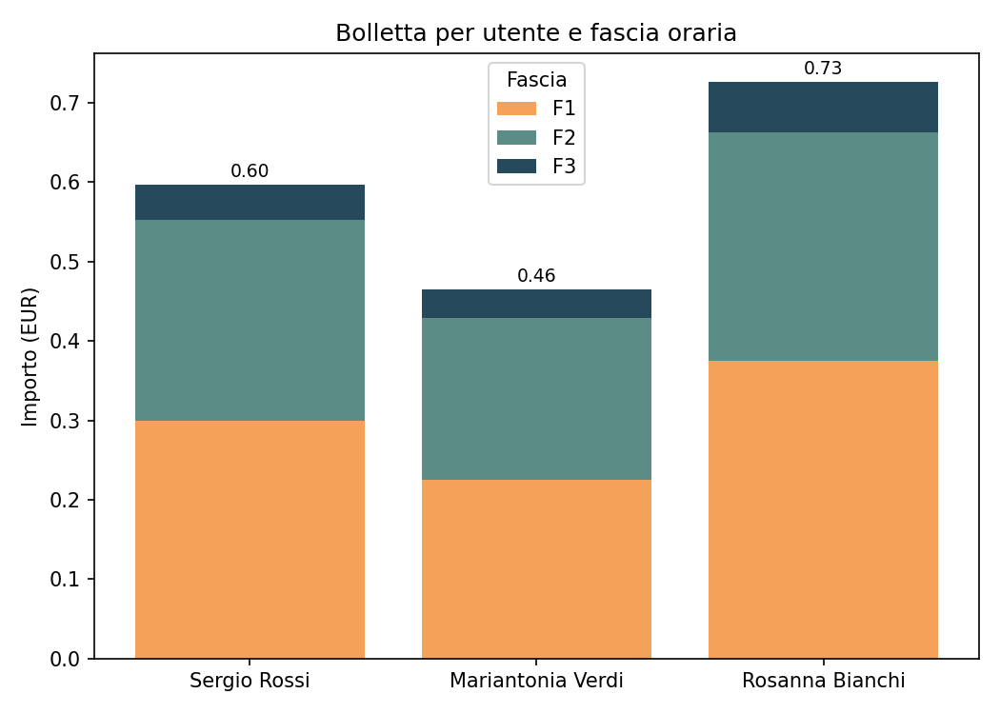

# Analisi Consumi e Prezzi Energia Elettrica

**[Italiano](#italiano)** | **[English](#english)**

---

## Italiano

Un piccolo sistema che simula il lavoro di un data analyst su un caso reale: calcolare la bolletta di ogni utente incrociando i consumi con tariffe orarie diverse, individuare il picco di consumo e la fascia più costosa per ciascuno, e restituire un report leggibile (testo + grafico).

Il dataset è sintetico (generato a mano, un solo giorno campione, 3 utenti), pensato per dimostrare la logica end-to-end, non per essere un dataset di produzione.

### Pipeline

1. **SQL (BigQuery)** crea schema e tabelle, popola dati di esempio (`queries/00_create_tables.sql`)
2. **SQL** calcola importi, picco di consumo e fascia più costosa per utente (`queries/01_analisi_consumi_e_prezzi.sql`)
3. **Python** esegue le query da BigQuery, elabora i risultati con pandas e produce un report testuale e un grafico riassuntivo (`bigquery.py`)

### Cosa vale la pena guardare

- **JOIN su intervalli orari semi-aperti**: le fasce tariffarie sono definite come `[ora_inizio, ora_fine)`, con un ramo di logica dedicato per la fascia che attraversa la mezzanotte (23:00-06:00), per evitare doppi conteggi o buchi ai confini.
- **Window function**: `MAX(kwh_consumati) OVER (PARTITION BY id_utente)` per il picco di consumo, e `QUALIFY ROW_NUMBER() OVER (PARTITION BY id_utente ORDER BY importo DESC, consumo DESC) = 1` per isolare la fascia più costosa per utente, con tie-break esplicito.
- **pandas oltre le basi**: merge multipli con gestione di colonne omonime, `pivot` con indice composto, e la combinazione `cumsum` + `shift` per calcolare le basi (`bottom`) delle barre impilate nel grafico, senza hardcodare somme parziali.

### Schema dati

| Tabella | Colonne principali |
|---|---|
| `utenti` | id_utente, nome |
| `consumi` | id_consumo, id_utente, timestamp, kwh_consumati |
| `tariffe` | fascia, ora_inizio, ora_fine, costo_kwh |

### Esempio di output

```
Utente Sergio Rossi
Fascia F1: 2.00 kwh -> EUR 0.30
Fascia F2: 2.10 kwh -> EUR 0.25
Fascia F3: 0.50 kwh -> EUR 0.04
Picco di consumo: 2.10 kwh
Fascia piu' costosa: F1 -> EUR 0.30
```



### Come eseguirlo

Prerequisiti: un account Google Cloud con un progetto attivo (BigQuery ha una soglia gratuita generosa, sufficiente per questo dataset).

```bash
pip install pandas matplotlib google-cloud-bigquery
gcloud auth application-default login
python bigquery.py
```

### Struttura repo

```
.
├── bigquery.py
├── queries/
│   ├── 00_create_tables.sql
│   └── 01_analisi_consumi_e_prezzi.sql
├── img/
│   └── bar_chart.png
└── README.md
```

### Note

Dataset sintetico, un solo giorno campione, pochi utenti: la scelta è deliberata, l'obiettivo del progetto è dimostrare l'integrazione SQL avanzato + Python + pandas, non gestire scala reale.

---

## English

A small system that simulates a data analyst's typical task: calculating each user's bill by combining energy consumption with time-based pricing, finding each user's peak usage and most expensive pricing tier, and producing a readable report (text + chart).

The dataset is synthetic (hand-written, a single sample day, 3 users), meant to demonstrate the end-to-end logic rather than serve as a production dataset.

### Pipeline

1. **SQL (BigQuery)** creates the schema and tables, and seeds sample data (`queries/00_create_tables.sql`)
2. **SQL** computes billing amounts, peak consumption, and the most expensive pricing tier per user (`queries/01_analisi_consumi_e_prezzi.sql`)
3. **Python** runs the queries against BigQuery, processes the results with pandas, and produces a text report plus a summary chart (`bigquery.py`)

### Worth a look

- **Join on half-open time intervals**: pricing tiers are defined as `[start_hour, end_hour)`, with a dedicated logic branch for the tier that crosses midnight (23:00-06:00), avoiding double counting or gaps at the boundaries.
- **Window functions**: `MAX(kwh_consumati) OVER (PARTITION BY id_utente)` for peak consumption, and `QUALIFY ROW_NUMBER() OVER (PARTITION BY id_utente ORDER BY importo DESC, consumo DESC) = 1` to isolate each user's most expensive tier, with an explicit tie-break.
- **pandas beyond the basics**: multiple merges with duplicate-column handling, a `pivot` on a composite index, and the `cumsum` + `shift` combination to compute stacked-bar `bottom` values without hardcoding partial sums.

### Data schema

| Table | Main columns |
|---|---|
| `utenti` | id_utente, nome |
| `consumi` | id_consumo, id_utente, timestamp, kwh_consumati |
| `tariffe` | fascia, ora_inizio, ora_fine, costo_kwh |

### Sample output

```
User Sergio Rossi
Tier F1: 2.00 kwh -> EUR 0.30
Tier F2: 2.10 kwh -> EUR 0.25
Tier F3: 0.50 kwh -> EUR 0.04
Peak consumption: 2.10 kwh
Most expensive tier: F1 -> EUR 0.30
```


### How to run it

Prerequisites: a Google Cloud account with an active project (BigQuery's free tier is generous enough for this dataset).

```bash
pip install pandas matplotlib google-cloud-bigquery
gcloud auth application-default login
python bigquery.py
```

### Repo structure

```
.
├── bigquery.py
├── queries/
│   ├── 00_create_tables.sql
│   └── 01_analisi_consumi_e_prezzi.sql
├── img/
│   └── bar_chart.png
└── README.md
```

### Notes

Synthetic dataset, a single sample day, a handful of users: a deliberate choice, since the project's goal is to demonstrate advanced SQL, Python, and pandas integration, not to handle real-world scale.

---

**Sergio Boccassini** - [GitHub](https://github.com/boccassinisergio-afk) - [LinkedIn](https://linkedin.com/in/sergio-boccassini) - [X](https://x.com/boccassini_ai)
